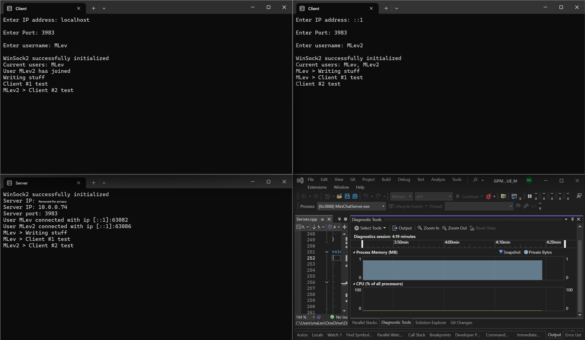

# Messenger Program
Programming a Windows command line messaging program. 

In this project I built a messaging program in C++ using Winsock 2. The aim of this project was to learn how sockets, IPV4 and IPV6 works. 

Example of client (2 top windows) and the server console (bottom left) with  the server performance.

### Features
- Handles both IPV4 and IPV6 IP address
- The clients and server use event polling to prevent blocking calls
- Close server via the `!closeServer` command on any clients
- Clients can set a username

### Dependencies
- Winsock 2

### Install & Build
This project uses CMake v3.25 for building the solution.

1. Download the repository
2. In the root directory add a `build/` folder
3. Via the terminal run the CMake command `cmake ..`
4. If successful a file with the extension `.sln` should be created. Open this file via visual studio and build the solution `ctrl + shift + B` then press `f5` to start the server.
5. To start a client in the solution explorer tab, right click on the 'MiniChatClient' project and click Debug -> Start new instance.
6. Repeat step 5 for adding more clients
7. Connect the clients to the server via the information shown on the server terminal